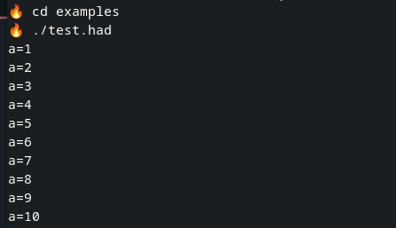

**myhell** is a Linux shell written in C++. The name is a small joke — if you remove the first letter from shell, you get hell, which fits the theme of the project and its custom scripting language called hades.

The shell is implemented entirely in C++, and the only external dependency is ANTLR4. You don’t need to install it manually — both the required JAR files and the antlr4_runtime repository are downloaded automatically during the build process.

## Building

``` sh
git clone https://github.com/PetermasterPerfect/myhell
cd myhell
mkdir build
cd build
cmake ..
make
```
Note on the command prompt:
By default, the shell uses a fire emoji 🔥 as the command prompt (see screenshot below). Unfortunately, some terminals do not render this character correctly, so you may see a less pleasant-looking prompt.

ANTLR (both JAR files and the `antlr4_runtime` project) is downloaded
automatically during CMake configure step.

## hades --- the scripting language

To keep the naming convention in the *hellish* climate, the language is
named **hades**.\
Its syntax resembles Bash but with simpler features.

### Conditional execution

`if` and `while` conditions are based on the **exit code** of the
command inside the condition brackets.

To evaluate arithmetic or boolean expressions, use the built‑in `eval`
command.\
`eval` sets the exit status based on whether the expression is true or
false. Arithmetic expression must be inside ``.

### Example script

``` hades
a=1
while [ eval `$a<=10` ]
{
        echo "a="$a
        a=`$a+1`
}
```

This script prints values of `a` from `1` to `10`.




## Stream redirections and pipes
My shell also supports stream redirections, pipes, and custom functions. When defining a function, the syntax is slightly different from Bash, as shown in the example below.

```
🔥 func count {
	wc -l $arg1
}
🔥 echo "Creating temporary file..."
Creating temporary file...
🔥 echo -e "line1
line2" > temp.txt
🔥 echo "Converting to uppercase:"
Converting to uppercase:
🔥 cat temp.txt | tr 'a-z' 'A-Z' > out.txt
🔥 cat temp.txt
line1
line2
🔥 cat out.txt
LINE1
LINE2
🔥 echo "Counting lines:"
Counting lines:
🔥 count temp.txt
2 temp.txt
```
------------------------------------------------------------------------
